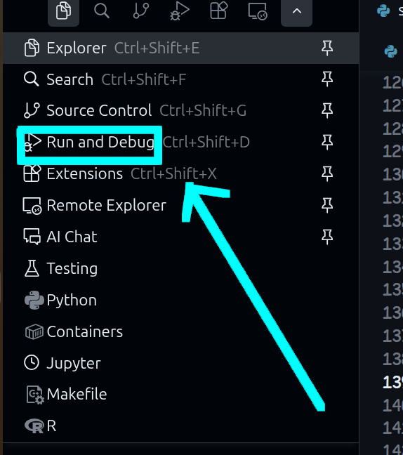
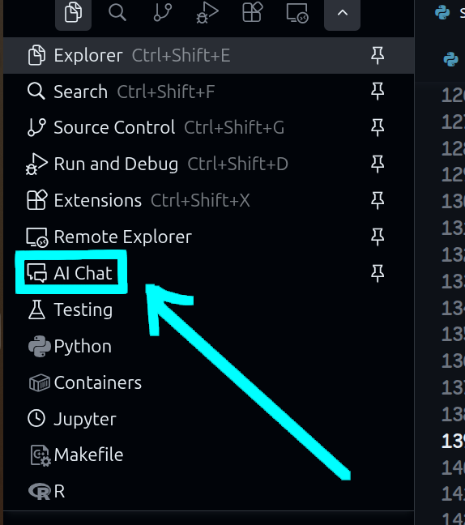

# AI Chat Sidebar - VS Code Extension

[English](README.md) | [中文](README.zh-CN.md)

---

一个强大的 VS Code 扩展，在侧边栏提供 AI 对话功能。AI 功能通过 Python 脚本实现，支持 RAG（检索增强生成）技术、工具调用系统，能够自动索引代码库并为 AI 提供上下文，还可以直接修改代码文件。

## 功能特性

### 核心功能

- 📱 **侧边栏聊天界面** - 简洁美观的对话界面
- 💬 **与 AI 进行对话** - 支持多轮对话和历史记录
- 🔍 **RAG 代码索引** - 自动索引工作区代码，为 AI 提供代码上下文
- 🔄 **自动更新索引** - 通过快照系统检测文件变化，自动更新 RAG 索引
- 📝 **Markdown 渲染** - 支持 Markdown 格式的消息渲染
- 🧹 **清除聊天历史** - 一键清空对话记录
- ⚙️ **可配置的 Python 路径和脚本路径**
- 📊 **输出日志** - 详细的日志输出，便于调试和监控

### 智能工具系统

AI 可以调用多种工具来完成复杂任务：

- 🔧 **代码补丁应用** (`apply_patch`) - AI 可以生成并应用代码补丁
- 💻 **命令执行** (`command`) - 执行系统命令（如 git、npm 等）
- 🌐 **网页获取** (`fetch_url`) - 获取网页内容
- 🔍 **代码检查** (`lint`) - 对代码进行语法检查
- 🌍 **网络搜索** (`web_search`) - 搜索网络信息
- 📚 **工作区 RAG** (`workspace_rag`) - 使用 RAG 检索代码上下文
- 📁 **工作区结构** (`workspace_structure`) - 获取工作区文件结构
- 📤 **发送报告** (`send_report`) - 发送最终报告给用户

### 代码修改功能

- 🔀 **Patch 预览** - AI 生成代码补丁后，自动在 VS Code 中显示差异预览
- ✅ **Accept/Reject 按钮** - 在聊天面板中提供按钮，让用户选择是否接受更改
- 🔄 **自动应用预览** - Patch 生成后自动应用到代码（预览模式）
- ↩️ **撤回更改** - 如果拒绝，可以撤回已应用的更改

### Flow Agent 系统

- 🤖 **智能代理** - 使用 Flow Agent 进行多轮迭代的工具调用
- 🔄 **自动迭代** - 最多支持 10 轮迭代，自动完成复杂任务
- 💾 **记忆系统** - 保存工具调用历史，为后续决策提供上下文

## 安装

### 前置要求

- Node.js 和 npm
- Python 3.9 或更高版本
- [uv](https://github.com/astral-sh/uv)（推荐的 Python 包管理器）

### 安装步骤

1. 安装 Node.js 依赖：
```bash
npm install
```

2. 设置 Python 环境（使用 uv）：

```bash
# 安装 uv（如果尚未安装）
# macOS/Linux:
curl -LsSf https://astral.sh/uv/install.sh | sh
# 或使用 pip:
# pip install uv

# 创建虚拟环境
uv venv

# 激活虚拟环境
# macOS/Linux:
source .venv/bin/activate
# Windows:
# .venv\Scripts\activate

# 安装 Python 依赖
uv sync
```

3. 配置 VS Code 扩展：

在 VS Code 设置中，将 `aiChat.pythonPath` 设置为 uv 虚拟环境中的 Python 解释器路径：

- macOS/Linux: `.venv/bin/python`（相对于项目根目录）
- Windows: `.venv\Scripts\python.exe`（相对于项目根目录）

或者使用绝对路径。

4. 编译 TypeScript：
```bash
npm run compile
```

5. 按 `F5` 在扩展开发主机中运行

## 配置

在 VS Code 设置中配置以下选项：

- `aiChat.pythonPath`: Python 解释器路径
  - 默认: `python3`
  - 使用 uv 环境时: `.venv/bin/python`（Linux/macOS）或 `.venv\Scripts\python.exe`（Windows）
  - 可以使用绝对路径或相对于项目根目录的路径
- `aiChat.aiScriptPath`: AI 服务脚本路径（默认: `python/ai_service.py`）

### Python 环境变量

确保在 `python/` 目录下创建 `.env` 文件并配置必要的环境变量：

```bash
# OpenAI 配置
OPENAI_API_KEY=your_api_key_here
OPENAI_MODEL=your_model_name  # 例如: gpt-4, gpt-3.5-turbo 等
OPENAI_BASE_URL=your_base_url  # 可选，用于自定义 API 端点
OPENAI_PROXY=your_proxy_url  # 可选，代理配置

# RAG 配置
RAG_ENABLED=true  # 是否启用 RAG 索引构建和更新，默认: true。设置为 false 可禁用 RAG 功能
RAG_UPDATE_INTERVAL_SECONDS=60  # RAG 更新服务的最小更新间隔（秒），默认: 60
RAG_DESCRIPTION_CONCURRENCY=2  # 描述生成的并发数，默认: 2
RAG_INDEXING_CONCURRENCY=2  # 索引构建的并发数，默认: 2
```

> **注意**：`.env` 文件应放在 `python/` 目录下，而不是项目根目录。

## 使用方法

### 使用 "Run and Debug" 运行 Agent

使用 `Run and Debug` 模式运行代码：



### 访问聊天界面

1. **通过活动栏图标**（推荐）：
   - 在 VS Code 左侧活动栏找到 💬 聊天图标
   - 点击图标打开 "AI Chat" 视图（见下图）

    

2. **通过命令面板**：
   - 按 `Ctrl+Shift+P` (Windows/Linux) 或 `Cmd+Shift+P` (Mac)
   - 输入 `AI Chat: Open AI Chat` 并选择

### 开始对话

1. 在输入框中输入消息
2. 按 `Enter` 或点击 "Send" 发送消息
3. AI 将处理消息并返回响应（支持 Markdown 格式）

### 代码修改工作流

当 AI 生成代码补丁时：

1. **自动预览**：Patch 会自动应用到代码中，并在 VS Code 中显示差异预览窗口
2. **查看更改**：在预览窗口中查看修改前后的差异
3. **做出决定**：
   - 点击 **Accept** 按钮：保留更改，补丁正式应用
   - 点击 **Reject** 按钮：撤回更改，代码恢复到修改前的状态
4. **按钮位置**：Accept/Reject 按钮显示在聊天面板的输入框上方

> **注意**：如果用户不点击按钮，按钮会一直显示，直到用户做出选择或新的 patch 生成。

### RAG 索引

- **首次打开工作区**：扩展会自动初始化 RAG 索引，索引整个代码库
- **自动更新**：扩展会定期检测文件变化并自动更新索引（间隔由 `RAG_UPDATE_INTERVAL_SECONDS` 配置）
- **关闭检测**：即使 VS Code 关闭时文件发生变化，重新打开时也会自动检测并更新
- **查看日志**：在 VS Code 的"输出"面板中，选择 "AI Service" 频道查看详细日志

## 工作原理

### AI 服务架构

扩展使用 Python 脚本处理 AI 请求，主要组件包括：

1. **前端** (`src/extension.ts`, `src/ChatPanel.ts`)
   - VS Code 扩展主程序
   - 管理 Webview 聊天界面
   - 处理用户输入和消息显示
   - 处理 Patch 预览和应用

2. **AI 服务** (`python/ai_service.py`)
   - 接收聊天消息和历史记录
   - 调用 Flow Agent 处理请求
   - 返回格式化的 AI 回复

3. **Flow Agent** (`python/agents/flow.py`)
   - 智能代理系统，支持多轮迭代
   - 自动调用工具完成任务
   - 管理工具调用历史和上下文

4. **工具系统** (`python/tools/`)
   - 可扩展的工具框架
   - 支持多种工具（补丁应用、命令执行、代码检查等）
   - 自动工具发现和注册

5. **LLM 客户端** (`python/llm/`)
   - 封装 OpenAI API 调用
   - 支持异步处理
   - 管理 API 配置和错误处理

6. **RAG 服务** (`python/rag/`)
   - 代码库索引和检索
   - 自动生成代码描述
   - 增量更新索引

### 事件流系统

扩展使用事件流系统来传递信息：

- **ToolCallEvent**: 工具调用事件
- **ToolResultEvent**: 工具执行结果事件
- **ReportEvent**: 最终报告事件（通过 `send_report` 工具）
- **MessageEvent**: 普通消息事件

所有事件都会在聊天界面中显示，保留完整的对话历史。

### RAG 索引流程

1. **初始化**：首次打开工作区时，扫描所有代码文件并创建索引
2. **快照系统**：使用文件哈希快照检测变化
3. **增量更新**：仅更新变更的文件，提高效率
4. **上下文检索**：AI 回答问题时，RAG 系统会检索相关代码上下文

### Patch 应用流程

1. **生成补丁**：AI 通过 `apply_patch` 工具生成代码补丁
2. **自动应用**：补丁自动应用到代码文件（预览模式）
3. **显示预览**：在 VS Code 中打开差异预览窗口
4. **用户选择**：用户通过 Accept/Reject 按钮决定是否保留更改
5. **执行操作**：
   - Accept: 保留更改（补丁已应用，无需额外操作）
   - Reject: 撤回更改（恢复到修改前的状态）

## 自定义 AI 功能

### 修改 AI 服务

编辑 `python/ai_service.py` 文件，可以自定义 AI 响应逻辑。

### 修改 Flow Agent

编辑 `python/agents/flow.py` (ReAct Flow)或者同目录`planact_flow.py` (PlanAct Flow) 下的文件，可以：
- 调整最大迭代次数
- 修改工具调用逻辑
- 自定义提示词

### 添加新工具

1. 在 `python/tools/` 目录下创建新工具文件
2. 继承 `MCPTool` 基类
3. 实现必要的属性和方法
4. 工具会自动被发现和注册

示例工具结构：
```python
from tools.base_tool import MCPTool

class MyCustomTool(MCPTool):
    @property
    def name(self) -> str:
        return "my_tool"
    
    @property
    def agent_tool(self) -> bool:
        return True  # 是否暴露给 AI
    
    def get_tool_definition(self) -> Dict[str, Any]:
        # 返回工具定义
        pass
    
    async def execute(self, ...) -> Dict[str, Any]:
        # 执行工具逻辑
        pass
```

### 修改 LLM 配置

编辑 `python/llm/chat_llm.py` 文件，可以：
- 更换不同的 LLM 提供商
- 调整模型参数
- 添加自定义提示词

### 调整 RAG 行为

编辑 `python/rag/` 目录下的相关文件，可以：
- 修改代码切片策略
- 调整描述生成方式
- 自定义检索算法

## 开发

### TypeScript 编译

```bash
# 编译
npm run compile

# 监听模式编译（自动重新编译）
npm run watch
```

### Python 开发

项目使用 `uv` 作为 Python 包管理器：

```bash
# 安装依赖（如果需要）
uv sync

# 安装依赖（dev版本，运行测试需要）
uv sync --extra dev

# 激活虚拟环境
source .venv/bin/activate  # Linux/macOS
# 或
.venv\Scripts\activate  # Windows
```

### 运行测试

运行测试需要安装dev版本的依赖（见上文）。

```bash
# 运行 Python 工具测试
cd python
python -m pytest tests/ -v

# 或运行单个测试文件
python tests/test_apply_patch_tool.py
```

### 调试

1. 在 VS Code 或者Cursor等VS Code架构的代码编辑器中，按`Run and Debug`键启动扩展开发主机（见下图）
2. 在开发主机中测试扩展功能
3. 查看调试控制台和输出面板（"AI Service" 频道）获取日志


### 项目结构

```
.
├── src/                    # TypeScript 源代码
│   ├── extension.ts        # 扩展主入口
│   ├── ChatPanel.ts        # 聊天面板逻辑
│   ├── patchPreview.ts     # Patch 预览提供者
│   ├── patchUtils.ts        # Patch 工具函数
│   └── snapshot.ts         # 快照系统
├── python/                  # Python 服务
│   ├── ai_service.py       # AI 服务主脚本
│   ├── agents/              # Agent 系统
│   │   ├── flow.py         # ReAct Flow Agent
│   │   ├── memory.py       # 记忆系统
│   │   └── planact_flow.py # PlanAct Flow Agent
│   ├── tools/               # 工具系统
│   │   ├── base_tool.py    # 工具基类
│   │   ├── tool_factory.py # 工具工厂
│   │   ├── apply_patch_tool.py
│   │   ├── command_tool.py
│   │   ├── fetch_url_tool.py
│   │   ├── lint_tool.py
│   │   ├── message_tool.py
│   │   ├── parallel_task_executor.py
│   │   ├── search_replace_tool.py
│   │   ├── send_report_tool.py
│   │   ├── web_search_tool.py
│   │   ├── workspace_rag_tool.py
│   │   └── workspace_structure_tool.py
│   ├── llm/                 # LLM 客户端
│   │   ├── chat_llm.py
│   │   └── rag_llm.py
│   ├── rag/                 # RAG 索引服务
│   │   ├── class_slicer.py
│   │   ├── description_generator.py
│   │   ├── function_slicer.py
│   │   ├── hash.py
│   │   ├── incremental_updater.py
│   │   ├── indexing.py
│   │   └── rag_service.py
│   ├── rag_init_service.py  # RAG 初始化服务
│   ├── rag_update_service.py # RAG 更新服务
│   ├── models/              # 数据模型
│   ├── prompts/             # 提示词
│   │   └── flow_prompt.py
│   ├── utils/               # 工具函数
│   │   ├── logger.py
│   │   └── patch_parser.py
│   └── tests/               # 测试
├── media/                   # 静态资源（CSS 等）
│   └── chat.css            # 聊天界面样式
├── out/                     # TypeScript 编译输出
├── doc/                     # 文档
├── logs/                    # 日志文件
├── sample_ws/               # 示例工作区
├── package.json            # Node.js 配置
├── pyproject.toml          # Python 项目配置
├── tsconfig.json           # TypeScript 配置
└── uv.lock                 # uv 锁定文件
```

## 许可证

MIT

