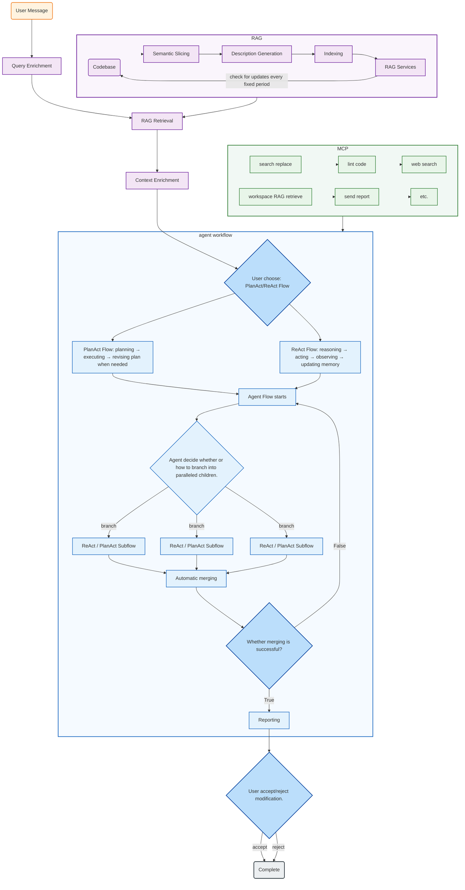

```mermaid
---
config:
  layout: dagre
---
flowchart TB
 subgraph s1["agent workflow"]
        U2{"User choose: PlanAct/ReAct Flow"}
        M["Automatic merging"]
        AM{"Whether merging is successful?"}
        REP["Reporting"]
        PAF["PlanAct Flow: planning → executing → revising plan when needed"]
        RAF["ReAct Flow: reasoning → acting → observing → updating memory"]
        AG["Agent Flow starts"]
        BR{"Agent decide whether or how to branch into paralleled children."}
        PW1["ReAct / PlanAct Subflow"]
        PW2["ReAct / PlanAct Subflow"]
        PW3["ReAct / PlanAct Subflow"]
  end
 subgraph s2["MCP"]
        SR["search replace"]
        LNT["lint code"]
        WEB["web search"]
        WRR["workspace RAG retrieve"]
        SRP["send report"]
        ETC["etc."]
        SR --> LNT --> WEB 
        WRR --> SRP --> ETC
        
  end
 subgraph s3["RAG"]
        A["Codebase"]
        B["Semantic Slicing"]
        C["Description Generation"]
        D["Indexing"]
        E["RAG Services"]
  end
    A --> B
    B --> C
    C --> D
    D --> E
    E -- check for updates every fixed period --> A
    U("User Message") --> Q["Query Enrichment"]
    Q --> R["RAG Retrieval"]
    R --> CE["Context Enrichment"]
    CE --> U2
    M --> AM
    AM -- True --> REP
    AM -- False --> AG
    REP --> U3{"User accept/reject modification."}
    U3 -- accept --> DONE["Complete"]
    U3 -- reject --> DONE
    s3 --> R
    s2 --> s1
    U2 --> PAF & RAF
    BR -- branch --> PW1 & PW2 & PW3
    PW1 --> M
    PW2 --> M
    PW3 --> M
    PAF --> AG
    RAF --> AG
    AG --> BR

    A@{ shape: rounded}
    DONE@{ shape: rounded}
  
  %% ===== Color Definitions =====
classDef agent fill:#E3F2FD,stroke:#1565C0,stroke-width:1.5px;
classDef decision fill:#BBDEFB,stroke:#0D47A1,stroke-width:2px;
classDef tool fill:#E8F5E9,stroke:#2E7D32,stroke-width:1.5px;
classDef rag fill:#F3E5F5,stroke:#6A1B9A,stroke-width:1.5px;
classDef user fill:#FFF3E0,stroke:#EF6C00,stroke-width:1.5px;
classDef terminal fill:#ECEFF1,stroke:#263238,stroke-width:2px;

%% ===== Agent Workflow =====
class AG,PAF,RAF,BR,PW1,PW2,PW3,M,REP agent;
class U2,AM,U3 decision;

%% ===== MCP Tools =====
class AP,EC,SR,LNT,WEB,FU,WRR,SM,SRP,EPT,ETC tool;

%% ===== RAG System =====
class A,B,C,D,E,Q,R,CE rag;

%% ===== User & Terminal =====
class U user;
class DONE terminal;

%% ===== Subgraph Background Styles =====
style s1 fill:#F5FAFF,stroke:#1565C0,stroke-width:2px
style s2 fill:#F1F8F4,stroke:#2E7D32,stroke-width:2px
style s3 fill:#FAF5FC,stroke:#6A1B9A,stroke-width:2px

%% IMPORTANT:
%% Replace 0,1,2,3,4 with the actual edge indices for the MCP chain in your rendered order
linkStyle 0,1,2,3,4 stroke-width:0px;

```